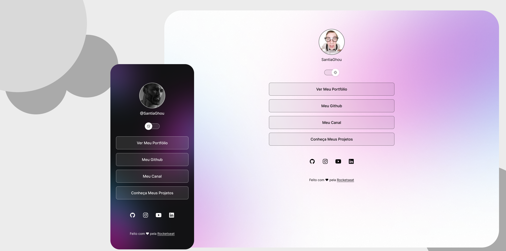

# DevLinks
<h1 align="center"> DevLinks </h1>

  Projeto desenvolvido como parte do curso <strong>Discovery</strong> da Rocketseat, marcando meu retorno ao mundo da programação web. O foco está nos fundamentos e na criação de aplicações modernas com as melhores práticas.

  Um programa exclusivo e gratuito promovido pela Rocketseat para ensino de tecnologias WEB.  
  <a href="https://lp.rocketseat.com.br/devlinks/inscricao?utm_source=github&utm_medium=descricao&utm_campaign=capture-devlinks&utm_term=organic&utm_content=descricao-github-mayk-brito">Clique aqui para estudar esse projeto em formato de vídeo.</a>

  <a href="#-tecnologias">Tecnologias</a>&nbsp;&nbsp;&nbsp;|&nbsp;&nbsp;&nbsp;
  <a href="#-projeto">Projeto</a>&nbsp;&nbsp;&nbsp;|&nbsp;&nbsp;&nbsp;
  <a href="#-layout">Layout</a>&nbsp;&nbsp;&nbsp;|&nbsp;&nbsp;&nbsp;
  <a href="#memo-licença">Licença</a>

  

 

  

## 🚀 Tecnologias

Esse projeto foi desenvolvido com as seguintes tecnologias:

- HTML e CSS
- JavaScript
- Git e GitHub
- Figma

## 💻 Projeto

O **DevLinks** é um agregador de links que serve como um cartão de visitas online.

## 🔖 Layout

Você pode visualizar o layout do projeto através [DESSE LINK](https://www.figma.com/community/file/1187422022288947321). Para acessá-lo, é necessário ter uma conta no [Figma](https://figma.com).

## :memo: Licença

Esse projeto está sob a licença MIT.

---

Feito com ♥ pela Rocketseat :wave: [Participe da nossa comunidade!](https://discord.gg/rocketseat)

